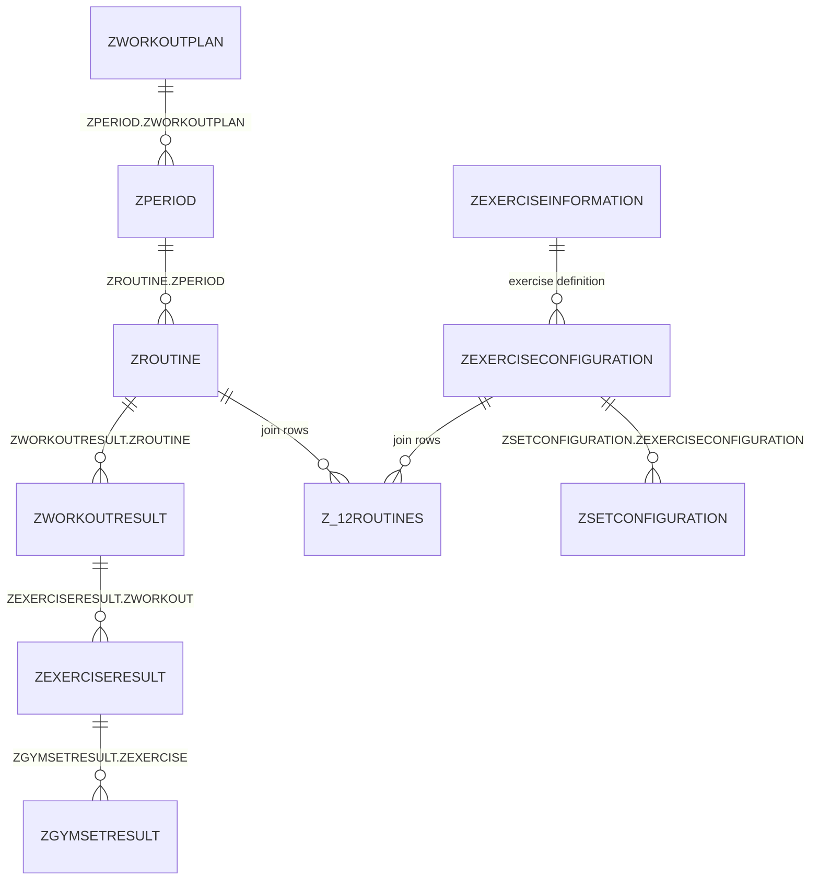

# Liftin Database Schema

## Complete Template -> Result Structure

| Level | Hierarchy Name | Example Value           | Template Table           | Parent FK Column         | Result Table      | Parent FK Column |
| ----- | -------------- | ----------------------- | ------------------------ | ------------------------ | ----------------- | ---------------- |
| 1     | Program        | MAPS Anabolic           | `ZWORKOUTPLAN`           | -                        | -                 | -                |
| 2     | Period/Week    | Week 2                  | `ZPERIOD`                | `ZWORKOUTPLAN`           | -                 | -                |
| 3     | Routine/Day    | Phase 2 / Day 2         | `ZROUTINE`               | `ZPERIOD`                | `ZWORKOUTRESULT`  | `ZROUTINE`       |
| 4     | Exercise       | Dumbbell Overhead Press | `ZEXERCISECONFIGURATION` | via `Z_12ROUTINES`       | `ZEXERCISERESULT` | `ZWORKOUT`       |
| 5     | Set            | Set 1: 15 reps @ 11.4kg | `ZSETCONFIGURATION`      | `ZEXERCISECONFIGURATION` | `ZGYMSETRESULT`   | `ZEXERCISE`      |



## Template Structure (Planned)

```text
ZWORKOUTPLAN (Program)
  └── ZPERIOD (Week)
      └── ZROUTINE (Routine)
          └── ZEXERCISECONFIGURATION (Exercise settings)
              └── ZSETCONFIGURATION (Individual set plans)
```

## Result Structure (Performed)

```text
          ZWORKOUTRESULT (Completed routine)
          └── ZEXERCISERESULT (Exercise performed in that workout)
              └── ZGYMSETRESULT (Individual set completed)
```

## Quirks And Gotchas

- `ZWORKOUTPLAN.ZISCURRENT` does **not** reliably represent the active program shown in the app UI.
  Active program is driven by `ZWORKOUTPROGRAMSINFO.ZSELECTEDWORKOUTPROGRAMID` (BLOB), matched to `ZWORKOUTPLAN.ZID`.
- Program week order should **not** be inferred from `ZPERIOD.Z_PK`.
  For program detail views, order by `ZPERIOD.Z_FOK_WORKOUTPLAN` (ascending), then `Z_PK` as tie-breaker.
  Example for program `8`: `38, 37, 36, 39`.
- Routine order within a week should **not** be inferred from `ZROUTINE.Z_PK` or routine name.
  For routine detail ordering, use `ZROUTINE.Z_FOK_PERIOD` (ascending), then `Z_PK` as tie-breaker.
  Example for week `38`: `179, 188, 200, 198, 187, 181`.
- Some routines are linked to programs only through `ZROUTINE.ZPERIOD -> ZPERIOD.ZWORKOUTPLAN`.
  Do not assume `ZROUTINE.ZWORKOUTPLAN` is always populated.
- Planned RPE uses sentinel semantics:
  `16` is effectively the default/unspecified value and is best normalized to `null` in CLI output.
- Weight storage and display units differ:
  planned and logged weight values appear to be stored in kg even when user preference is imperial.
  Resolve display unit from `ZSETTINGS.ZMEASURMENTUNIT` (fallback to equipment unit metadata) and convert for output as needed.
- Date/timestamp fields use Apple/Core Data epoch seconds (offset from Unix epoch), not Unix seconds directly.
  Convert before comparing/formatting.
- `ZID` fields are often BLOB identifiers (not human-readable strings). For CLI UX, use numeric `Z_PK` as primary selector.

## Notes

- Program and week are template/planning concepts; performed data starts at routine level.
- Exercise definitions live in `ZEXERCISEINFORMATION`.
- The routine-exercise join table is `Z_12ROUTINES`.
