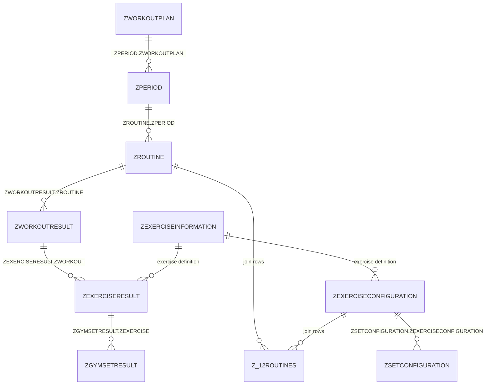

# Liftin Database Schema

## Complete Template -> Result Structure

| Level | Hierarchy Name | Example Value           | Template Table           | Parent FK Column         | Result Table      | Parent FK Column |
| ----- | -------------- | ----------------------- | ------------------------ | ------------------------ | ----------------- | ---------------- |
| 1     | Program        | MAPS Anabolic           | `ZWORKOUTPLAN`           | -                        | -                 | -                |
| 2     | Period/Week    | Week 2                  | `ZPERIOD`                | `ZWORKOUTPLAN`           | -                 | -                |
| 3     | Routine/Day    | Phase 2 / Day 2         | `ZROUTINE`               | `ZPERIOD`                | `ZWORKOUTRESULT`  | `ZROUTINE`       |
| 4     | Exercise       | Dumbbell Overhead Press | `ZEXERCISECONFIGURATION` | via `Z_12ROUTINES`       | `ZEXERCISERESULT` | `ZWORKOUT`       |
| 5     | Set            | Set 1: 15 reps @ 11.4kg | `ZSETCONFIGURATION`      | `ZEXERCISECONFIGURATION` | `ZGYMSETRESULT`   | `ZEXERCISE`      |


```mermaid
erDiagram
  ZWORKOUTPLAN ||--o{ ZPERIOD : "ZPERIOD.ZWORKOUTPLAN"
  ZPERIOD ||--o{ ZROUTINE : "ZROUTINE.ZPERIOD"
  ZROUTINE ||--o{ ZWORKOUTRESULT : "ZWORKOUTRESULT.ZROUTINE"
  ZROUTINE ||--o{ Z_12ROUTINES : "join rows"
  ZEXERCISECONFIGURATION ||--o{ Z_12ROUTINES : "join rows"
  ZEXERCISECONFIGURATION ||--o{ ZSETCONFIGURATION : "ZSETCONFIGURATION.ZEXERCISECONFIGURATION"
  ZWORKOUTRESULT ||--o{ ZEXERCISERESULT : "ZEXERCISERESULT.ZWORKOUT"
  ZEXERCISEINFORMATION ||--o{ ZEXERCISERESULT : "exercise definition"
  ZEXERCISERESULT ||--o{ ZGYMSETRESULT : "ZGYMSETRESULT.ZEXERCISE"
  ZEXERCISEINFORMATION ||--o{ ZEXERCISECONFIGURATION : "exercise definition"
```

## Template Structure (Planned)

```text
ZWORKOUTPLAN (Program)
  └── ZPERIOD (Week)
      └── ZROUTINE (Routine)
          └── ZEXERCISECONFIGURATION (Exercise settings)
              └── ZSETCONFIGURATION (Individual set plans)
```

## Result Structure (Performed)

```text
          ZWORKOUTRESULT (Completed routine)
          └── ZEXERCISERESULT (Exercise performed in that workout)
              └── ZGYMSETRESULT (Individual set completed)
```

## Quirks And Gotchas

- `ZWORKOUTPLAN.ZISCURRENT` does **not** reliably represent the active program shown in the app UI.
  Active program is driven by `ZWORKOUTPROGRAMSINFO.ZSELECTEDWORKOUTPROGRAMID` (BLOB), matched to `ZWORKOUTPLAN.ZID`.
- Program week order should **not** be inferred from `ZPERIOD.Z_PK`.
  For program detail views, order by `ZPERIOD.Z_FOK_WORKOUTPLAN` (ascending), then `Z_PK` as tie-breaker.
  Example for program `8`: `38, 37, 36, 39`.
- Routine order within a week should **not** be inferred from `ZROUTINE.Z_PK` or routine name.
  For routine detail ordering, use `ZROUTINE.Z_FOK_PERIOD` (ascending), then `Z_PK` as tie-breaker.
  Example for week `38`: `179, 188, 200, 198, 187, 181`.
- Exercise order within a routine should **not** be inferred from exercise config id or name.
  For program detail ordering, use `Z_12ROUTINES.Z_FOK_12EXERCISES` (ascending), then exercise config id as tie-breaker.
  Examples:
  routine `179`: `160, 181`;
  routine `188`: `53, 169, 61`;
  routine `201`: `79, 31, 160`.
- Some routines are linked to programs only through `ZROUTINE.ZPERIOD -> ZPERIOD.ZWORKOUTPLAN`.
  Do not assume `ZROUTINE.ZWORKOUTPLAN` is always populated.
- Planned RPE uses sentinel semantics:
  `16` is effectively the default/unspecified value and is normalized to `null` in API output.
- `ZEXERCISECONFIGURATION.ZUSEINDIVIDUALSETS` controls planned-set source of truth:
  when it is `1`, use related `ZSETCONFIGURATION` rows ordered by `ZSETINDEX`, but cap the result to the positive `ZSETS` count. Do not synthesize missing child rows when fewer remain after edits. Otherwise, ignore any child rows and synthesize the planned sets from `ZSETS`, `ZREPS`, `ZWEIGHT`, and `ZTIME`.
- Weight storage and display units differ:
  planned and logged weight values are stored in kg even when the Liftin setting is imperial.
  The HTTP API defaults to lb and supports a `unit=kg` override; its intentionally Liftin-specific conversion is `kg * 2.2`.
- Date/timestamp fields use Apple/Core Data epoch seconds (offset from Unix epoch), not Unix seconds directly.
  Convert before comparing/formatting.
- `ZID` fields are often BLOB identifiers (not human-readable strings). Use numeric `Z_PK` as the HTTP resource identifier.
- `ZGYMSETRESULT.ZWARMUPSET` (integer): flags whether a set was performed as a warm-up.
  `0` = working set, `1` = warm-up set.
  In a typical dataset this column is approximately 3000 warm-up sets out of ~8000 total sets (~37%).
  Use `isWarmup: boolean` in the application layer.
  History summary aggregates should exclude warm-up sets; keep the raw set rows and flag them instead.

## Notes

- Program and week are template/planning concepts; performed data starts at routine level.
- Exercise definitions live in `ZEXERCISEINFORMATION`.
- For performed exercises, resolve the definition through `ZEXERCISERESULT.ZEXERCISE`; this direct link is authoritative even when `ZCONFIGURATION.ZINFORMATION` differs or is null.
- The routine-exercise join table is `Z_12ROUTINES`.
