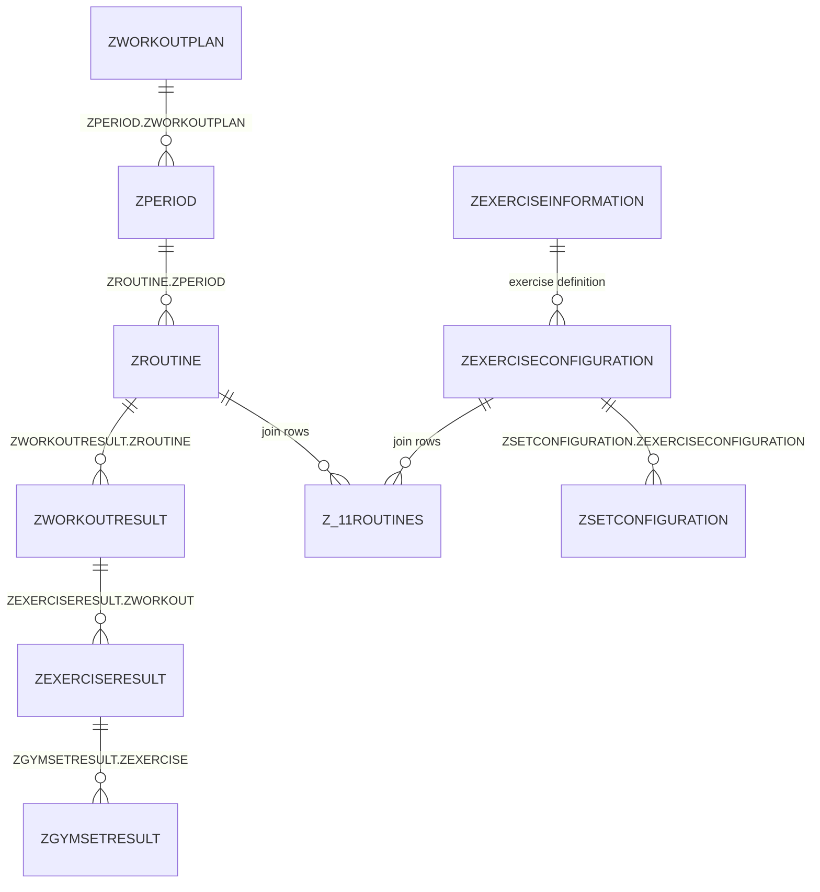

# Workout Database Hierarchy

### Complete Template → Result Structure

| Level | Hierarchy Name | Example Value           | Template Table           | Parent FK Column         | Result Table      | Parent FK Column |
| ----- | -------------- | ----------------------- | ------------------------ | ------------------------ | ----------------- | ---------------- |
| 1     | Program        | MAPS Anabolic           | `ZWORKOUTPLAN`           | -                        | -                 | -                |
| 2     | Period/Week    | Week 2                  | `ZPERIOD`                | `ZWORKOUTPLAN`           | -                 | -                |
| 3     | Routine/Day    | Phase 2 / Day 2         | `ZROUTINE`               | `ZPERIOD`                | `ZWORKOUTRESULT`  | `ZROUTINE`       |
| 4     | Exercise       | Dumbbell Overhead Press | `ZEXERCISECONFIGURATION` | via `Z_11ROUTINES`       | `ZEXERCISERESULT` | `ZWORKOUT`       |
| 5     | Set            | Set 1: 15 reps @ 11.4kg | `ZSETCONFIGURATION`      | `ZEXERCISECONFIGURATION` | `ZGYMSETRESULT`   | `ZEXERCISE`      |



### Template Structure (What you plan)

```
ZWORKOUTPLAN (Program)
  └── ZPERIOD (Week)
      └── ZROUTINE (Routine)
          └── ZEXERCISECONFIGURATION (Exercise settings)
              └── ZSETCONFIGURATION (Individual set plans)
```

### Result Structure (What you actually did)

```
          ZWORKOUTRESULT (Completed routine)
          └── ZEXERCISERESULT (Exercise performed in that workout)
              └── ZGYMSETRESULT (Individual set completed)
```

### Notes

- **Program** and **Period/Phase** only exist as templates - no result tracking at these levels
- The **template ↔ result mapping** begins at the **Routine** level
- In the mapping view: **solid arrow** = direct FK link, **dashed arrow** = conceptual/derived mapping (not a direct FK)
- Exercise definitions are stored in `ZEXERCISEINFORMATION` (library of exercises like "Squat", "Bench Press")
- Join table `Z_11ROUTINES` links routines to their exercise configurations
